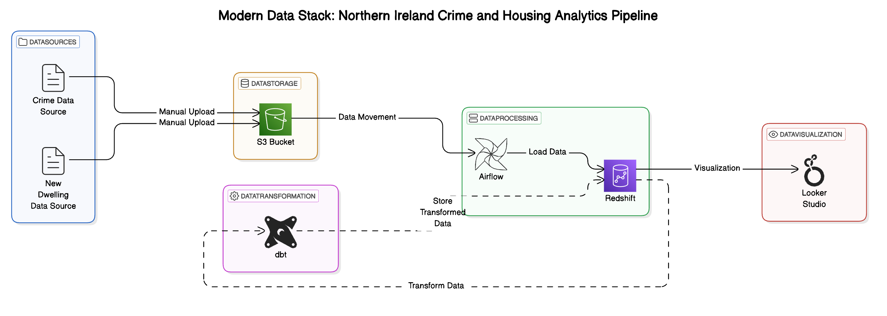

# Northern Ireland Housing and Crime Data Pipeline 🏰

## Overview 📋
This Apache Airflow DAG implements an automated ETL pipeline for processing and analyzing Northern Ireland crime and new dwelling completion data. The pipeline extracts data from S3, loads it into Redshift staging tables, performs data transformation, and conducts quality checks.

## Data Analytics & Insights 📊
- **Northern Ireland Crime & Housing Statistics Dashboard**: [View Interactive Dashboard](https://lookerstudio.google.com/reporting/00d16ee0-71be-4de6-92df-f6739064cfd9/page/bxxPE#) 
  - Interactive visualization of regional crime patterns and dwelling completions
  - Cross-analysis of housing development and crime statistics by district
  - Real-time access to transformed pipeline data
 
## Architecture Diagram 🏗️

Key Components:
- **Data Sources**: Crime Data and New Dwelling Data
- **Data Storage**: AWS S3 Bucket
- **Data Processing**: Apache Airflow
- **Data Transformation**: dbt
- **Data Warehouse**: AWS Redshift
- **Data Visualization**: Looker Studio

## Data Sources 📊
- **Crime Data**: Police recorded crime monthly data 👮
  - Source: S3 bucket `northern-ireland-crime-data`
  - File: `police-recorded-crime-monthly-data.csv`
  - Format: CSV with headers

- **Dwelling Data**: New dwelling completions by Local Government District (LGD) 🏠
  - Source: S3 bucket `northern-ireland-new-dwelling-data`
  - File: `new-dwelling-completions-by-lgd-q1-2005-q1-2015.csv`
  - Format: CSV with headers
  - Time range: Q1 2005 - Q1 2015

## Pipeline Architecture 🏗️

### Schedule ⏰
- Runs daily
- No backfill enabled
- Execution timeout: 2 hours

### Components 🔧

#### Crime Data Pipeline 📊
1. **Staging Table**: `stg_police_recorded_crime`
   - Calendar year
   - Month
   - Policing district
   - Crime type
   - Data measure
   - Count

2. **Production Table**: `police_recorded_crime`
   - Includes all staging fields
   - Added data quality controls
   - Timestamp tracking
   - Error handling

#### Dwelling Data Pipeline 🏘️
1. **Staging Table**: `stg_new_dwelling_completions`
   - LGD (Local Government District)
   - Quarterly data from Q1 2005 to Q1 2015
   - Raw string values

2. **Production Table**: `new_dwelling_completions`
   - Transformed integer values
   - Data validation
   - Timestamp tracking
   - Error handling

### Data Quality Controls ✅
- Input validation for numeric fields
- Error logging tables for both datasets
- Null value handling
- Special character handling
- Metrics collection and reporting
- Automated table analysis

## Dependencies 🔗
- Apache Airflow
- AWS Redshift
- AWS S3
- Python packages:
  - `airflow`
  - `datetime`
  - AWS providers for Airflow

## Required Connections 🔌
1. **AWS S3 Connection**: `aws_s3_conn`
2. **Redshift Connection**: `redshift_default`

## Database Configuration 💾
- Database: `dev`
- Cluster: `dwh-redshift-dw`
- User: `awsuser`
- Schema: `public`

## Error Handling ❌
1. **Crime Data Validation**
   - Year format validation
   - Numeric value validation
   - Special value handling ('/0', 'NA', 'N/A', '-')
   - Empty value handling

2. **Dwelling Data Validation**
   - LGD name validation
   - Numeric conversion validation
   - Empty string handling

## Monitoring and Metrics 📈
### Crime Data Metrics
- Total records loaded
- Records by year
- Data quality statistics

### Dwelling Data Metrics
- Total dwelling records
- Null value analysis for recent quarters
- Data completeness checks

## Task Dependencies 🔄

## Maintenance 🔧
- Staging tables are automatically dropped after use
- Error logging tables are archived and dropped
- Regular ANALYZE commands are run on production tables
- Transaction management for data consistency

## Best Practices ⭐
1. Use transactions for data consistency
2. Implement comprehensive error logging
3. Perform data quality checks
4. Archive and clean up temporary tables
5. Validate data before loading to production
6. Monitor execution metrics

## Security Considerations 🔒
- AWS credentials managed through Airflow connections
- Database user permissions required
- S3 bucket access permissions required
- Redshift cluster security group configuration needed

## Troubleshooting 🔍
Common issues can be diagnosed through:
- Error logging tables
- Data quality check results
- Airflow task logs
- Redshift STL_LOAD_ERRORS table
